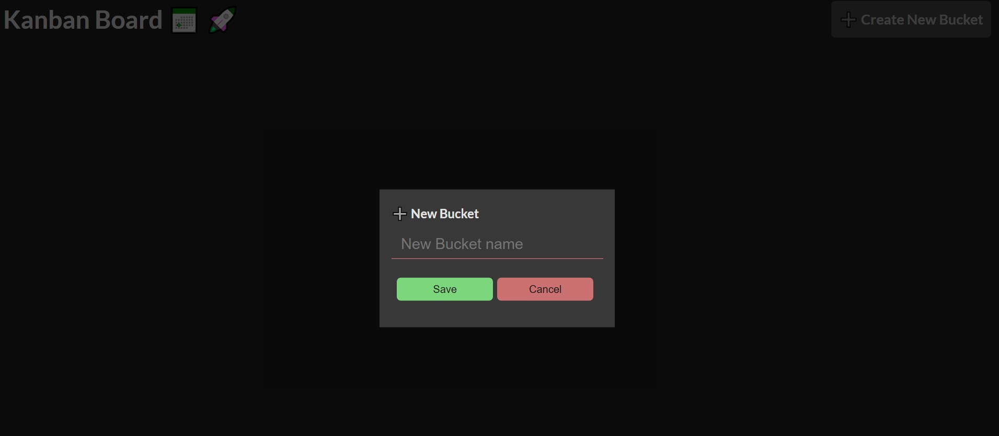
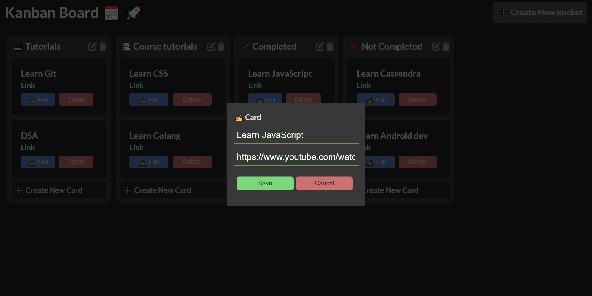
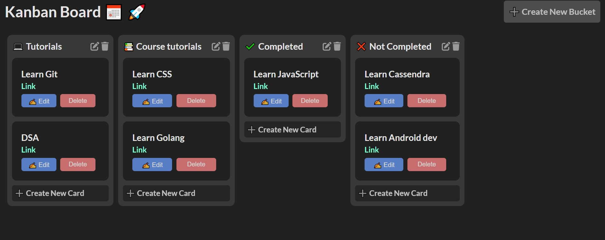

# Kanban-board

### Manage your learnings/work schedule using Kanban board.

**Track your progress and manage easily**

#### Create a new bucket

#### Add / edit cards in a bucket

#### Move cards from one to other bucket or change their order simply by dragging it

